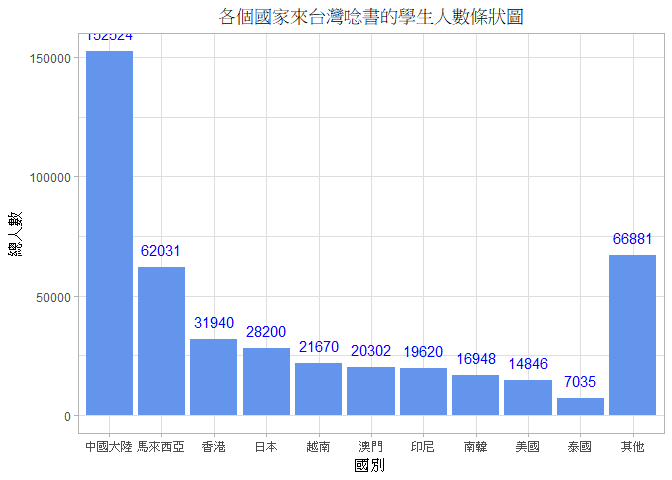
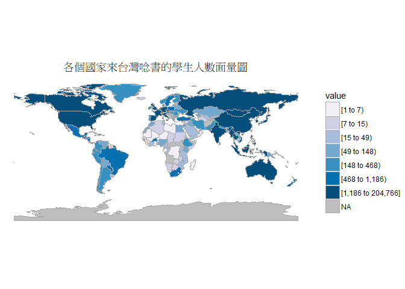
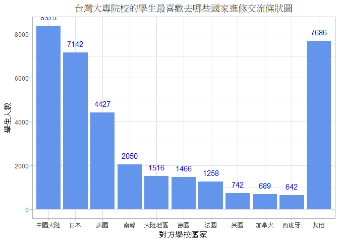
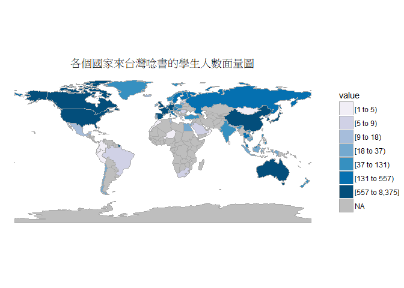
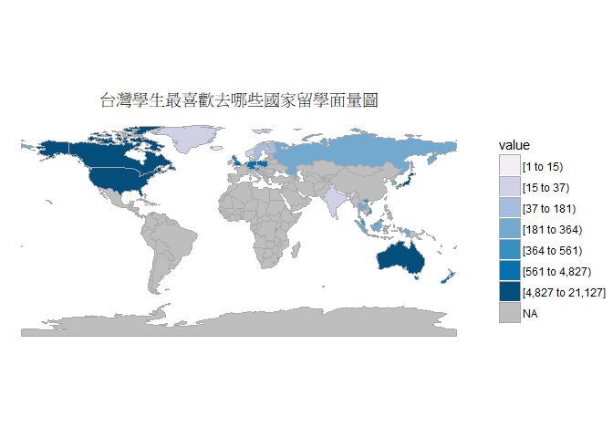
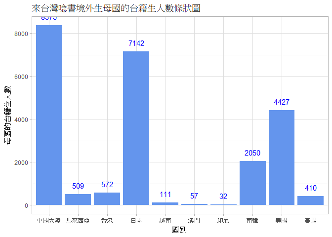

106-2 大數據分析方法 作業二
================
張仁樵

作業完整說明[連結](https://docs.google.com/document/d/1aLGSsGXhgOVgwzSg9JdaNz2qGPQJSoupDAQownkGf_I/edit?usp=sharing)

學習再也不限定在自己出生的國家，台灣每年有許多學生選擇就讀國外的大專院校，同時也有人多國外的學生來台灣就讀，透過分析[大專校院境外學生人數統計](https://data.gov.tw/dataset/6289)、[大專校院本國學生出國進修交流數](https://data.gov.tw/dataset/24730)、[世界各主要國家之我國留學生人數統計表](https://ws.moe.edu.tw/Download.ashx?u=C099358C81D4876CC7586B178A6BD6D5062C39FB76BDE7EC7685C1A3C0846BCDD2B4F4C2FE907C3E7E96F97D24487065577A728C59D4D9A4ECDFF432EA5A114C8B01E4AFECC637696DE4DAECA03BB417&n=4E402A02CE6F0B6C1B3C7E89FDA1FAD0B5DDFA6F3DA74E2DA06AE927F09433CFBC07A1910C169A1845D8EB78BD7D60D7414F74617F2A6B71DC86D17C9DA3781394EF5794EEA7363C&icon=..csv)可以了解103年以後各大專院校國際交流的情形。請同學分析以下議題，並以視覺化的方式呈現分析結果，呈現103年以後大專院校國際交流的情形。

來台境外生分析
--------------

### 資料匯入

-   變數說明
    -   `c103`:103學年大專校院境外學生人數統計（國別CSV檔）
    -   `c104`:103學年大專校院境外學生人數統計（國別CSV檔）
    -   `c105`:105學年大專校院境外學生人數統計（國別CSV檔）
    -   `c106`:106學年大專校院境外學生人數統計（國別CSV檔）
    -   `s103`:103學年大專校院境外學生人數統計（校別CSV檔）
    -   `s104`:104學年大專校院境外學生人數統計（校別CSV檔）
    -   `s105`:105學年大專校院境外學生人數統計（校別CSV檔）
    -   `s106`:106學年大專校院境外學生人數統計（校別CSV檔）

``` r
#載入package
library(readr)
library(dplyr)
library(knitr)
library(ggplot2)
library(choroplethr)
library(choroplethrMaps)
#資料讀檔
c103<-read_csv("http://stats.moe.gov.tw/files/detail/103/103_ab103_C.csv")
c104<-read_csv("http://stats.moe.gov.tw/files/detail/104/104_ab104_C.csv")
c105<-read_csv("http://stats.moe.gov.tw/files/detail/105/105_ab105_C.csv")
c106<-read_csv("http://stats.moe.gov.tw/files/detail/106/106_ab105_C.csv")
s103<-read_csv("http://stats.moe.gov.tw/files/detail/103/103_ab103_S.csv")
s104<-read_csv("http://stats.moe.gov.tw/files/detail/104/104_ab104_S.csv")
s105<-read_csv("http://stats.moe.gov.tw/files/detail/105/105_ab105_S.csv")
s106<-read_csv("http://stats.moe.gov.tw/files/detail/106/106_ab105_S.csv")
```

### 資料處理(國家別)

-   函式說明
    -   `cleandata_c`:對來台念書(國別)學生資料進行資料處理
-   變數說明
    -   `total_c103`:103年度來台念書(國別)學生的國別、總人數
    -   `total_c104`:104年度來台念書(國別)學生的國別、總人數
    -   `total_c105`:105年度來台念書(國別)學生的國別、總人數
    -   `total_c106`:106年度來台念書(國別)學生的國別、總人數
    -   `total_c`:合併4個年度資料後的data.frame
    -   `result_c`:將4個年度總人數加總後的data.frame

``` r
#定義資料處理(國家別)的function
cleandata_c<-function(x){
  y<-
    x%>%
    mutate(總人數=rowSums(x[,3:11]))%>%
    select(國別,總人數)
  return(y)
}
#對所有國家別的csv檔案進行cleandata_c，並重新定義欄位名稱
total_c103<-cleandata_c(c103)
colnames(total_c103)=c("國別","總人數103")
total_c104<-cleandata_c(c104)
colnames(total_c104)=c("國別","總人數104")
total_c105<-cleandata_c(c105)
colnames(total_c105)=c("國別","總人數105")
total_c106<-cleandata_c(c106)
colnames(total_c106)=c("國別","總人數106")
#對4個data.frame進行merge
total_c<-
  Reduce(function(x, y) merge(x, y, by="國別",all=T),
         list(total_c103, total_c104, total_c105,total_c106))
#加總所有年度的人數成總人數
result_c<-
  total_c%>%
  mutate(總人數=rowSums(total_c[,2:5],na.rm=T))%>%
  select(國別,總人數)%>%
  arrange(desc(總人數))
```

### 哪些國家來台灣唸書的學生最多呢？

``` r
kable(head(result_c,10))
```

| 國別     | 總人數 |
|:---------|:------:|
| 中國大陸 | 152524 |
| 馬來西亞 |  62031 |
| 香港     |  31940 |
| 日本     |  28200 |
| 越南     |  21670 |
| 澳門     |  20302 |
| 印尼     |  19620 |
| 南韓     |  16948 |
| 美國     |  14846 |
| 泰國     |  7035  |

### 資料處理(學校別)

-   函式說明
    -   `cleandata_s`:對來台念書(學校別)學生資料進行資料處理</br> 備註:刪除非學位生-大陸研修生欄位，這樣就不會有`無法區分校別`的觀察值出現
-   變數說明
    -   `total_s103`:103年度來台念書(學校別)學生的國別、總人數
    -   `total_s104`:104年度來台念書(學校別)學生的國別、總人數
    -   `total_s105`:105年度來台念書(學校別)學生的國別、總人數
    -   `total_s106`:106年度來台念書(學校別)學生的國別、總人數
    -   `total_s`:合併4個年度資料後的data.frame
    -   `result_s`:將4個年度總人數加總後的data.frame

``` r
#定義資料處理(學校別)的function
cleandata_s<-function(x){
  y<-
    x%>%
    mutate(總人數=rowSums(x[,c(4:9,11,12)]))%>%
    select(學校名稱,總人數)
  return(y)
}
#對所有學校別的csv檔案進行cleandata_s，並重新定義欄位名稱
total_s103<-cleandata_s(s103)
colnames(total_s103)=c("學校名稱","總人數103")
total_s104<-cleandata_s(s104)
colnames(total_s104)=c("學校名稱","總人數104")
total_s105<-cleandata_s(s105)
colnames(total_s105)=c("學校名稱","總人數105")
total_s106<-cleandata_s(s106)
colnames(total_s106)=c("學校名稱","總人數106")
#對4個data.frame進行merge
total_s<-
  Reduce(function(x, y) merge(x, y, by="學校名稱",all=T),
         list(total_s103, total_s104, total_s105,total_s106))
#加總所有年度的人數成總人數
result_s<-
  total_s%>%
  mutate(總人數=rowSums(total_s[,2:5],na.rm=T))%>%
  select(學校名稱,總人數)%>%
  arrange(desc(總人數))
```

### 哪間大學的境外生最多呢？

``` r
kable(head(result_s,10))
```

| 學校名稱         | 總人數 |
|:-----------------|:------:|
| 國立臺灣師範大學 |  22113 |
| 國立臺灣大學     |  18199 |
| 中國文化大學     |  16074 |
| 銘傳大學         |  16057 |
| 淡江大學         |  13887 |
| 國立政治大學     |  11626 |
| 國立成功大學     |  10982 |
| 輔仁大學         |  9499  |
| 逢甲大學         |  9474  |
| 中原大學         |  7662  |

### 各個國家來台灣唸書的學生人數條狀圖

-   變數說明
    -   `sum_other`:其他國家(前10名外)的來台灣念書的學生人數(6688)
    -   `result2`:只有前10名及其他國家來台灣念書學生人數的data.frame
    -   `orderID`:協助條狀圖的X軸排序</br> (按照row的index，即總人數遞減排序，最後加其他)
    -   `chart1`:各個國家來台灣唸書的學生人數條狀圖

``` r
#處理其他國家(前10名外)
sum_other<-sum(result_c[11:nrow(result_c),2])
result2<-
  result_c%>%
  rbind(c("其他",sum_other))
result2$總人數<-as.numeric(result2$總人數)
result2<-result2[c(1:10,nrow(result2)),]
orderID<-as.integer(rownames(result2))
result2$國別<-factor(orderID
                   ,labels=result2$國別)
#作圖
chart1<-
  ggplot(data=result2,
         aes(x=國別,y=總人數))+
  geom_bar(stat = "identity",fill = "cornflowerblue")+
  geom_text(aes(label=result2$總人數),color = "blue", vjust=-1)+
  theme_light()+
  labs(title="各個國家來台灣唸書的學生人數條狀圖")+
  theme(plot.title = element_text(hjust = 0.5))
chart1
```



### 各個國家來台灣唸書的學生人數面量圖

-   變數說明
    -   `countryname`:國家中英文對照表，附檔在同一資料夾的CountriesComparisionTable.csv
    -   `result3`:要使用在面量圖中region,value的data.frame
    -   `chart2`:各個國家來台灣唸書的學生人數面量圖

``` r
#資料讀檔
countryname<-read_csv("CountriesComparisionTable.csv")
#處理region,value
result3<-merge(result_c,countryname,by.x="國別",by.y="Taiwan")
colnames(result3)<-c("國別","value","ISO3","region")
##中國大陸=中國大陸(5)+香港(91)+澳門(159)
##可以用grep("中國大陸",result3$國別)...之類的去查index
result3[5,2]=result3[5,2]+result3[91,2]+result3[159,2]
##索馬利亞民主共和國=索馬利亞民主共和國(107)+索馬利蘭共和國(108)
result3[107,2]=result3[107,2]+result3[108,2]
result3<-
  result3%>%
  subset(region!="Unmatch")%>%
  subset(`國別`!="索馬利蘭共和國")%>%
  select(region,value)
#作圖
chart2<-
  country_choropleth(result3)+
  scale_fill_brewer(palette=9,na.value="grey")+
  labs(title="各個國家來台灣唸書的學生人數面量圖")+
  theme(plot.title = element_text(hjust = 0.5))
chart2
```



台灣學生國際交流分析
--------------------

### 資料匯入與處理

-   變數說明
    -   `ods_result`:大專校院本國學生出國進修交流數（csv）檔，附檔在同一資料夾的Student\_RPT\_07.csv
    -   `result4_1`:台灣大專院校學生最愛去的國家及去的人數的data.frame
    -   `result4_2`:最愛出國的大學名稱及去的人數的data.frame

``` r
#資料讀檔
ods_result<-read_csv("Student_RPT_07.csv")
#檢查osd轉成的csv讀檔是否成功
head(ods_result)
```

    ## # A tibble: 6 x 15
    ##   學年度  學期 設立別 學校類別 學校代碼 學校名稱  系所代碼 系所名稱  學制 
    ##    <int> <int> <chr>  <chr>    <chr>    <chr>        <int> <chr>     <chr>
    ## 1    101     1 公立   一般大學 0001     國立政治大學~   220326 土耳其語文學系~ 學士班(~
    ## 2    101     1 公立   一般大學 0001     國立政治大學~   220326 土耳其語文學系~ 學士班(~
    ## 3    101     1 公立   一般大學 0001     國立政治大學~   220326 土耳其語文學系~ 學士班(~
    ## 4    101     1 公立   一般大學 0001     國立政治大學~   220326 土耳其語文學系~ 學士班(~
    ## 5    101     1 公立   一般大學 0001     國立政治大學~   220326 土耳其語文學系~ 學士班(~
    ## 6    101     1 公立   一般大學 0001     國立政治大學~   220326 土耳其語文學系~ 學士班(~
    ## # ... with 6 more variables: `對方學校(機構)國別(地區)` <chr>,
    ## #   `對方學校(機構)中文名稱` <chr>, `對方學校(機構)英文名稱` <chr>,
    ## #   小計 <int>, 男 <int>, 女 <int>

``` r
#處理最愛去哪個國家
result4_1<-
  ods_result%>%
  subset(`學年度`>=103)%>%
  group_by(`對方學校(機構)國別(地區)`)%>%
  summarise(count=sum(小計))%>%
  arrange(desc(count))
#處理哪間大學最愛出國
result4_2<-
  ods_result%>%
  subset(`學年度`>=103)%>%
  group_by(學校名稱)%>%
  summarise(count=sum(小計))%>%
  arrange(desc(count))
```

### 台灣大專院校的學生最喜歡去哪些國家進修交流呢？

``` r
kable(head(result4_1,10))
```

| 對方學校(機構)國別(地區) |  count|
|:-------------------------|------:|
| 中國大陸                 |   8375|
| 日本                     |   7142|
| 美國                     |   4427|
| 南韓                     |   2050|
| 大陸地區                 |   1516|
| 德國                     |   1466|
| 法國                     |   1258|
| 英國                     |    742|
| 加拿大                   |    689|
| 西班牙                   |    642|

### 哪間大學的出國交流學生數最多呢？

``` r
kable(head(result4_2,10))
```

| 學校名稱     |  count|
|:-------------|------:|
| 國立臺灣大學 |   2224|
| 淡江大學     |   2038|
| 國立政治大學 |   1876|
| 逢甲大學     |   1346|
| 元智大學     |   1106|
| 國立臺北大學 |    956|
| 國立交通大學 |    951|
| 東海大學     |    931|
| 東吳大學     |    873|
| 國立成功大學 |    846|

### 台灣大專院校的學生最喜歡去哪些國家進修交流條狀圖

-   變數說明
    -   `sum_other2`:其他國家(前10名外)的來自台灣的進修學生人數(7686)
    -   `result5`:只有前10名及其他國家來自台灣的進修學生人數的data.frame
    -   `orderID`:協助條狀圖的X軸排序</br> (按照row的index，即總人數遞減排序，最後加其他)
    -   `chart3`:台灣大專院校的學生最喜歡去哪些國家進修交流條狀圖

``` r
#處理其他國家(前10名外)
sum_other2<-sum(result4_1[11:nrow(result4_1),2])
result5<-
  result4_1%>%
  rbind(c("其他",sum_other2))
result5$count<-as.numeric(result5$count)
result5<-result5[c(1:10,nrow(result5)),]
orderID<-as.integer(rownames(result5))
result5$`對方學校(機構)國別(地區)`<-
  factor(as.integer(rownames(result5))
         ,labels=result5$`對方學校(機構)國別(地區)`)
#作圖
chart3<-
  ggplot(data=result5,
         aes(x=`對方學校(機構)國別(地區)`,y=count))+
  geom_bar(stat = "identity",fill = "cornflowerblue")+
  geom_text(aes(label=result5$count),color = "blue", vjust=-1)+
  theme_light()+
  labs(title="台灣大專院校的學生最喜歡去哪些國家進修交流條狀圖",
       x="對方學校國家")+
  theme(plot.title = element_text(hjust = 0.5))
chart3
```



### 台灣大專院校的學生最喜歡去哪些國家進修交流面量圖

-   變數說明
    -   `result4`:result4\_1重新命名後的暫存變數
    -   `result6`:要使用在面量圖中region,value的data.frame
    -   `chart4`:台灣大專院校的學生最喜歡去哪些國家進修交流面量圖

``` r
#重新命名result4_1的colnames，因為merge中的by不接受()，並儲存在result4
result4<-result4_1
colnames(result4)<-c("國名","count")
#處理region,value
result6<-merge(result4,countryname,
               by.x="國名",by.y="Taiwan")
colnames(result6)<-c("國名","value","ISO3","region")
result6<-
  result6%>%
  subset(region!="Unmatch")%>%
  select(region,value)
#作圖
chart4<-
  country_choropleth(result6)+
  scale_fill_brewer(palette=9,na.value="grey")+
  labs(title="各個國家來台灣唸書的學生人數面量圖")+
  theme(plot.title = element_text(hjust = 0.5))
chart4
```



台灣學生出國留學分析
--------------------

### 資料匯入與處理

-   變數說明
    -   `world`:世界各主要國家之我國留學生人數統計表（csv）檔
    -   `result7`:台灣學生最喜歡去留學的國家、洲別、及去的人數的data.frame

``` r
#資料讀檔
world<-read_csv("https://ws.moe.edu.tw/Download.ashx?u=C099358C81D4876CC7586B178A6BD6D5062C39FB76BDE7EC7685C1A3C0846BCDD2B4F4C2FE907C3E7E96F97D24487065577A728C59D4D9A4ECDFF432EA5A114C8B01E4AFECC637696DE4DAECA03BB417&n=4E402A02CE6F0B6C1B3C7E89FDA1FAD0B5DDFA6F3DA74E2DA06AE927F09433CFBC07A1910C169A1845D8EB78BD7D60D7414F74617F2A6B71DC86D17C9DA3781394EF5794EEA7363C&icon=..csv")
#處理最愛去哪些國家留學
result7<-
  world%>%
  select(洲別:總人數)%>%
  arrange(desc(總人數))
```

### 台灣學生最喜歡去哪些國家留學呢？

``` r
kable(head(result7,10))
```

| 洲別   | 國別     | 總人數 |
|:-------|:---------|:------:|
| 美洲   | 美國     |  21127 |
| 大洋洲 | 澳大利亞 |  13582 |
| 亞洲   | 日本     |  8444  |
| 美洲   | 加拿大   |  4827  |
| 歐洲   | 英國     |  3815  |
| 歐洲   | 德國     |  1488  |
| 大洋洲 | 紐西蘭   |  1106  |
| 歐洲   | 波蘭     |   561  |
| 亞洲   | 馬來西亞 |   502  |
| 歐洲   | 奧地利   |   419  |

### 台灣學生最喜歡去哪些國家留學面量圖

-   變數說明
    -   `result8`:要使用在面量圖中region,value的data.frame
    -   `chart5`:台灣學生最喜歡去哪些國家留學面量圖

``` r
#把韓國改為南韓，因為中英文對照表中用的是南韓不是韓國
result7[13,2]<-"南韓"
#處理region,value
result8<-merge(result7,countryname,
               by.x="國別",by.y="Taiwan")
colnames(result8)<-c("國別","洲別","value","ISO3","region")
#作圖
chart5<-
  country_choropleth(result8)+
  scale_fill_brewer(palette=9,na.value="grey")+
  labs(title="台灣學生最喜歡去哪些國家留學面量圖")+
  theme(plot.title = element_text(hjust = 0.5))
chart5
```



綜合分析
--------

請問來台讀書與離台讀書的來源國與留學國趨勢是否相同(5分)？想來台灣唸書的境外生，他們的母國也有很多台籍生嗎？請圖文並茂說明你的觀察(10分)。

### 來台讀書與離台讀書的來源國與留學國趨勢是否相同

### 想來台灣唸書的境外生，他們的母國也有很多台籍生嗎

來台灣唸書的學生的境外生國家前10排行榜

| 國別     | 總人數 | 國別 | 總人數 | 國別 | 總人數 | 國別 | 總人數 | 國別 | 總人數 |
|:---------|:------:|:-----|:------:|:-----|:------:|:-----|:------:|:-----|:------:|
| 中國大陸 | 152524 | 香港 |  31940 | 越南 |  21670 | 印尼 |  19620 | 美國 |  14846 |
| 馬來西亞 |  62031 | 日本 |  28200 | 澳門 |  20302 | 南韓 |  16948 | 泰國 |  7035  |


